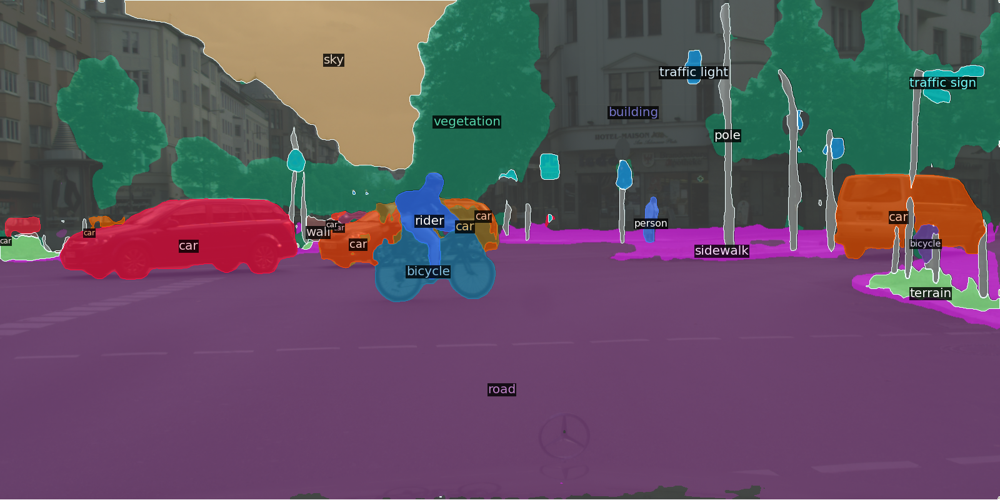

# Facebook AI: DETR 
## A consistent approach to perform fine tuning on transformer based architectures.
## Fine tuning of the pretrained COCO model on the Cityscapes dataset for panoptic segmentation 
## Report available on [Weights ad Biases](https://wandb.ai/veri/detr/reports/DETR-Panoptic-segmentation-on-Cityscapes-dataset--Vmlldzo2ODg3NjE)

